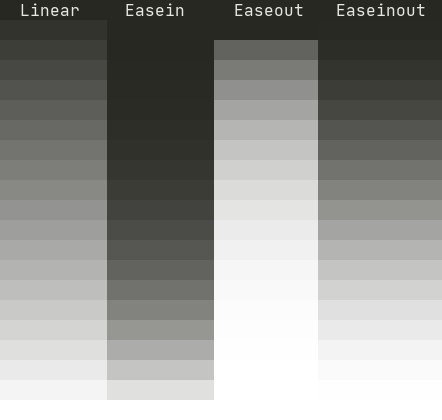

# Footprints vim plugin   
Highlight last edited lines: visualisation of `:changes` command on the fly.
It helps to keep focus on lines you are working on  

### USAGE
Change any text.  
That's it. That line will be highlighted.  
The older change - the dimmer highlight.  

### DEMO

https://user-images.githubusercontent.com/3949614/158836795-809abfeb-1e6a-4af9-8129-6ba278376bd3.mp4

---

### INSTALLATION
Example of installation and setting configs
```
  Plug 'axlebedev/footprints'
  let g:footprintsColor = '#3A3A3A'
  let g:footprintsTermColor = '208'
  let g:footprintsEasingFunction = 'linear'
  let g:footprintsHistoryDepth = 20
  let g:footprintsExcludeFiletypes = ['magit', 'nerdtree', 'diff']
  let g:footprintsEnabledByDefault = 1
  let g:footprintsOnCurrentLine = 0
```

---

### CONFIGURATION
##### `g:footprintsColor`
Default: `'#3A3A3A'` or `'#C1C1C1'` depending on `&background` setting  
Hex number. Color of the latest change highlight. Used in gui or if `&termguicolors`  
Older highlights will be dimmed to 'Normal' background according to `g:footprintsEasingFunction`.  
`let g:footprintsColor = '#275970'`

##### `g:footprintsTermColor`
Default: `208`  
Number. Color of the latest change highlight. Used in terminal if not `&termguicolors`  
`g:footprintsEasingFunction` is ignored.  
`let g:footprintsTermColor = '186'`

##### `g:footprintsEasingFunction`
Default: `'linear'`  
One of `linear`, `easein`, `easeout`, `easeinout`.  
How does footprint color 'cooldown' to usual background color  
`let g:footprintsEasingFunction = 'easeinout'`  


##### `g:footprintsHistoryDepth`
Default: `20`  
How many steps should be highlighted  
`let g:footprintsHistoryDepth = 10`  

##### `g:footprintsExcludeFiletypes`
Default: `[]`  
Which filetypes should not be processed by this plugin  
`let g:footprintsExcludeFiletypes = ['magit', 'nerdtree', 'diff']`  

##### `g:footprintsEnabledByDefault`
Default: `1`  
Boolean. Define if this plugin is enabled on vim start  
`let g:footprintsEnabledByDefault = 1`  

##### `g:footprintsOnCurrentLine`
Default: `0`  
Boolean. Define if current line should be highlighted or not.  
`let g:footprintsOnCurrentLine = 0`  

---

### COMMANDS

`:FootprintsDisable`  
`:FootprintsEnable`  
`:FootprintsToggle`  

  Enable/disable Footprints globally  

---

`:FootprintsBufferDisable`  
`:FootprintsBufferEnable`  
`:FootprintsBufferToggle`  

  Enable/disable Footprints only in current buffer

---

`:FootprintsCurrentLineDisable`  
`:FootprintsCurrentLineEnable`  
`:FootprintsCurrentLineToggle`  

  Enable/disable Footprint highlight for current line

---

### API

##### `footprints#SetColor(hexColor: string)`
Set `g:footprintsColor` and update highlights to new color.  
Note: this change will not be saved to next vim run, use `g:footprintsColor` for persistent change.  
`call footprints#SetColor('#FF0000')`  

##### `footprints#SetTermColor(termColorCode: number)`
Set `g:footprintsTermColor` and update highlights to new color.  
Note: this change will not be saved to next vim run, use `g:footprintsTermColor` for persistent change.  
`call footprints#SetTermColor(200)`  

##### `footprints#SetHistoryDepth(depth: number)`
Set `g:footprintsHistoryDepth` and update highlights to new depth.  
Note: this change will not be saved to next vim run, use `g:footprintsHistoryDepth` for persistent change.  
`call footprints#SetHistoryDepth(200)`  

##### `footprints#Footprints()`
Update footprints in current buffer  
`call footprints#Footprints()`  

##### `footprints#OnBufEnter()`
Update footprints on bufenter or any other case when current window contains some older highlights  
`call footprints#OnBufEnter()`  

##### `footprints#OnCursorMove()`
Update footprints when content was not changed, only update current line highlight  
`call footprints#OnCursorMove()`  

##### `footprints#Disable(forCurrentBuffer: bool)`
##### `footprints#Enable(forCurrentBuffer: bool)`
##### `footprints#Toggle(forCurrentBuffer: bool)`
Disable, enable or toggle footprints.
`forCurrentBuffer == 0` - do it globally  
`forCurrentBuffer == 1` - do only for current buffer  
```
    call footprints#Disable(0)
    call footprints#Enable(1)
    call footprints#Toggle(1)
```

##### `footprints#EnableCurrentLine()`
##### `footprints#DisableCurrentLine()`
##### `footprints#ToggleCurrentLine()`
Disable, enable or toggle footprint on current line.
```
call footprints#DisableCurrentLine()
call footprints#EnableCurrentLine()
call footprints#ToggleCurrentLine()
```

---

### TROUBLESHOOTING
If you use NeoVim, version 0.5+ is required

### NOTES
If you find a bug, or have an improvement suggestion -
please place an issue in this repository.

---

Check out Vim plugins:   
[**vim-gotoline-popup**](https://github.com/axlebedev/vim-gotoline-popup)  
[**vim-find-my-cursor**](https://github.com/axlebedev/vim-find-my-cursor)  

**<p>&nbsp;&nbsp;&nbsp;&nbsp;&nbsp;&nbsp;★</p>**
